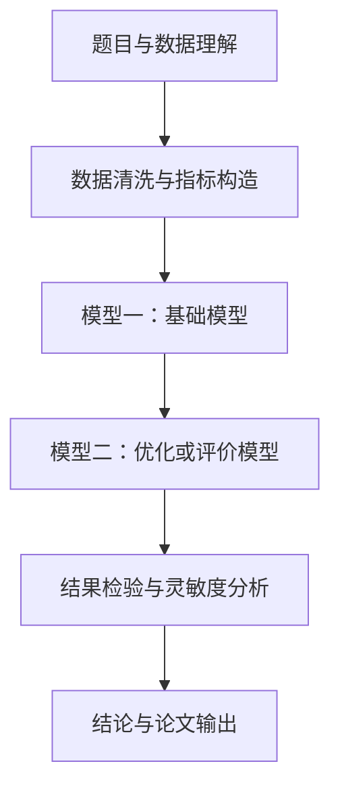

# 流程图占位模板

## 文件命名

默认文件名：`figures/modeling_workflow.pdf`

如果换名，需要同时修改：

- `paper/main.tex`
- `paper/writer.md`
- `figures/` 中的真实文件名

## Mermaid 草稿



## LaTeX 插入位置

```tex
\begin{figure}[H]
  \centering
  \includegraphics[width=0.86\textwidth]{modeling_workflow.pdf}
  \caption{整体建模流程图}
  \label{fig:workflow}
\end{figure}
```

## 绘图要求

- 节点文字短，不塞公式。
- 箭头体现数据流或决策流。
- 图中文字、caption、正文描述一致。
- 最终图导出为 PDF 或 PNG，优先 PDF。
